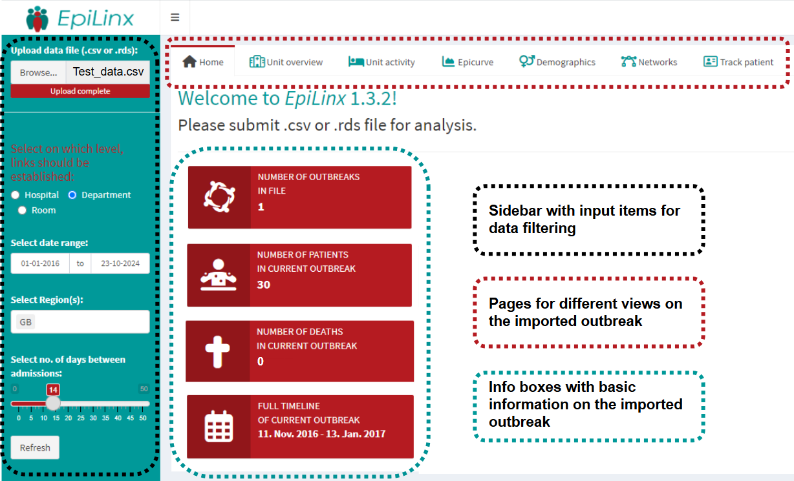

EpiLinx identifies temporal overlaps in patient hospital stays across departments and hospitals. The app allows users to explore these overlaps interactively through visualizations and tables.

This guide shows how to get started and navigate the core functionality of the application.
For more details, see the documentation and examples included in this repository.

```{r, echo = FALSE, out.width="200px", fig.align="center"}
knitr::include_graphics("../man/figures/EpiLinxLogo.png")
```

## Data requirements

After running app, the user is ready to upload her prepared data. Data must be submitted in CSV or RDA format. Some variables are mandatory, while others remain nice to have for epidemiological exploration.

```{r, echo=FALSE}
knitr::kable(
  data.frame(
    Variable = c("Outbreak", "Patient", "Gender", "Age", "Hospital", "Department","Room","Region", "Admission", "Discharge", "Sample date", "Day of death"),
    Type = c("string","integer","character","integer","string","string","string","string", "datetime (YYYY-MM-DD)", "datetime (YYYY-MM-DD)","datetime (YYYY-MM-DD)","datetime (YYYY-MM-DD)"),
    Description = c("Outbreak ID", "Unique patient ID", "Patient's gender (F/M)", "Patient's age at sample date", "Hospital name or ID", "Hospital department name or ID", "Department room ID", "Region/area name", "Time of admission", "Time of discharge", "Patient's sample date","Patient's eventual death date"),
    Required = c("No", "**Yes**","No","No","**Yes**","**Yes**","No","No","**Yes**","**Yes**","**Yes**","No")
  ),
  escape = FALSE
)
```
## Navigating the application


EpiLinx is designed for interactive exploration of patient overlaps. The interface allows users to filter data, adjust parameters, and inspect results across different levels. The sidebar is where most of the selections are made. EpiLinx' landingpage in the GUI looks like this:

```{r, echo=FALSE, fig.align="center", out.width="100%"}

```

#### The main steps when using the app are:

1. **Upload data**  
  Choose a dataset with hospital contact data in CSV or RDA via the "Browse"-button.

2. **Choose level of overlap**  
  Choose the level at which overlaps are calculated (room, department, or hospital).

3. **Select time window**  
   Define the period of interest. By default, data from 2016 to the present is shown. Use          shorter periods for easier interpretation.

4. **Select region**  
   Select one or more regions.

5. **Allow gap between admissions**  
   Define the allowed number of days between admissions when identifying "indirect"                links/overlaps.
   
6. **Inspect outputs**  
   Click through the pages and explore the generated outputs, including plots and tables, to       interpret patterns and relationships in the data.

The interface is dynamic, and all outputs update automatically when inputs are changed.

## Direct and indirect links

EpiLinx distinguishes between two types of links: direct and indirect.

**Direct links** represent overlaps where two patients are admitted to the same department on the same day (or over overlapping days).

**Indirect links** represent patients admitted to the same department within a defined number of days between their admissions.

Links can also be established at the hospital level to capture broader connections. This applies to direct links only, not gaps between admissions.
