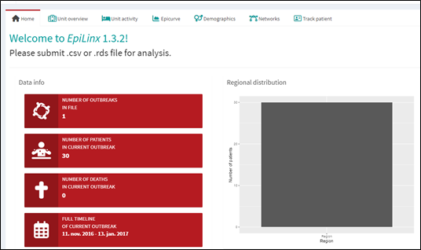
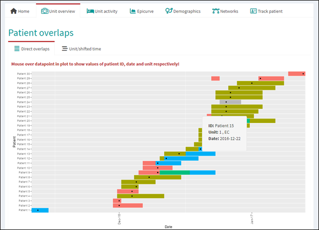
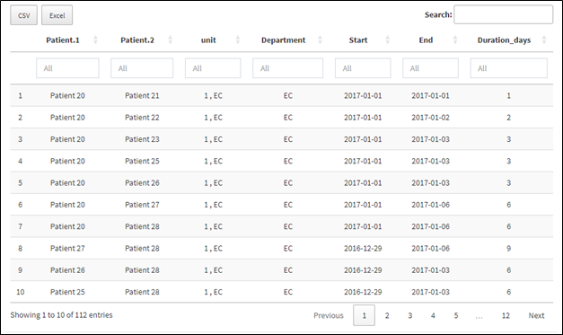
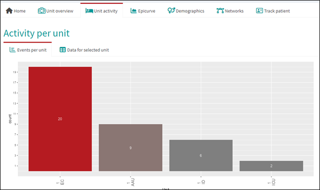
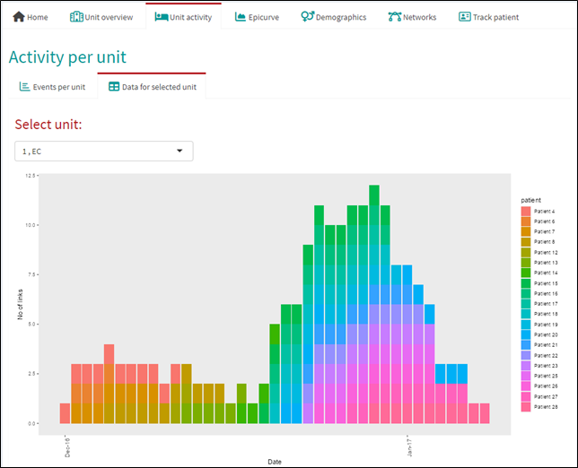
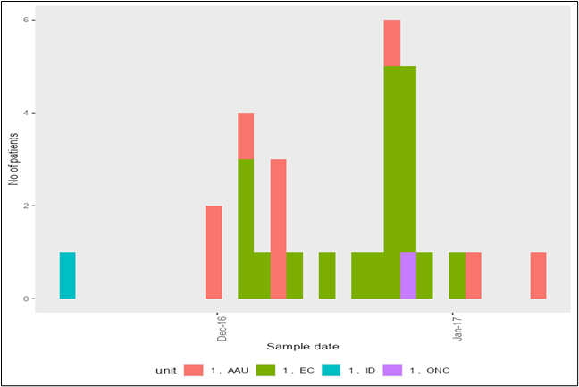
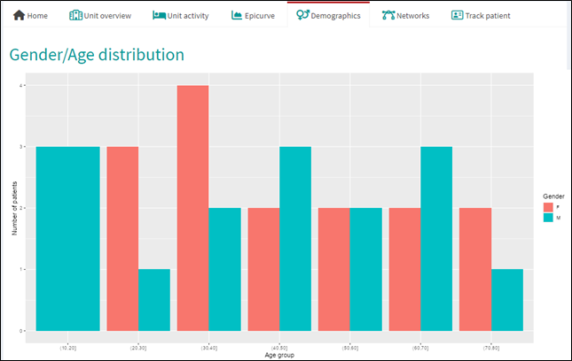
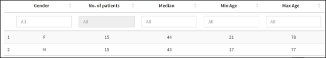
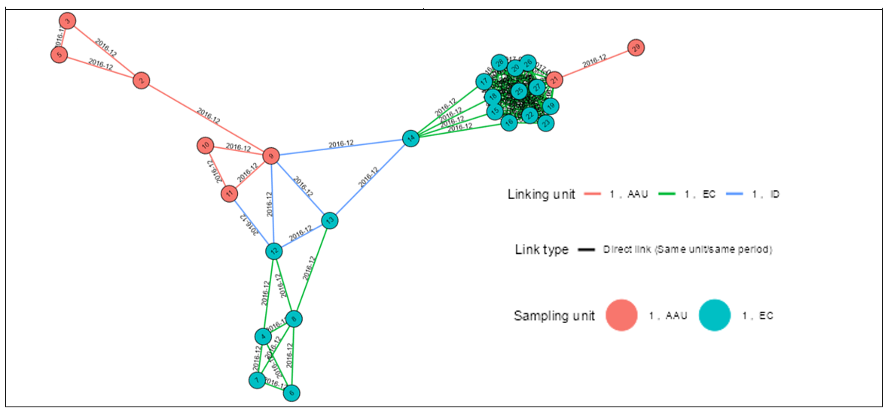
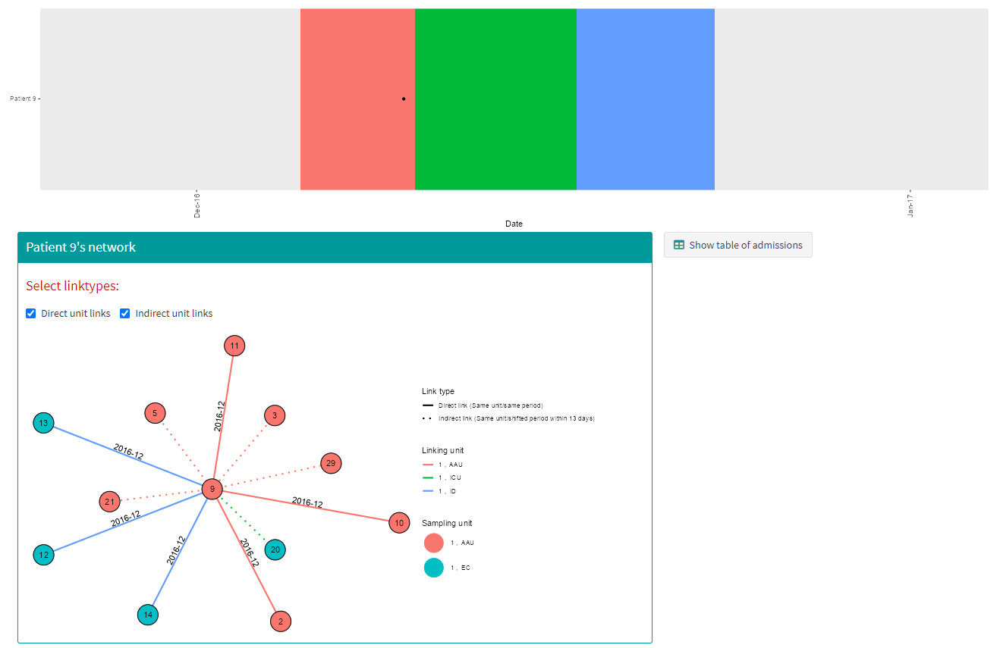

```{r setup, include=FALSE}
knitr::opts_chunk$set(echo = TRUE)
```

This section presents the main outputs generated by EpiLinx.
The app provides a range of interactive plots and tables designed to support exploration of transmission patterns with focus on epidemiological links.
The examples below illustrate transmission patterns from a British hospital outbreak.

## Descriptive info

After initial import of data, four red, info boxes describing general features of the data along with a bar chart with regional distribution of patients appear on the homepage:

```{r, echo=FALSE, fig.align="center", out.width="80%"}

```

In this case, the one outbreak submitted lasted from November 2016 to January 2017, contained 30 patients and no deaths. All 30 patients were hospitalised in one region.

## Unit overview

The Unit overview page displays a timeline of all admissions. Hover to view details (date, department, hospital, patient ID), and use drag or double-click to zoom.

```{r, echo=FALSE, fig.align="center", out.width="80%"}

```

Here, the 30 patients visited five different hospital departments in total (colored bars). Patient 24 was the only patient to visit one specific department, which is therefore shown in grey. Grey departments indicate that only a single patient has visited them and thus cannot form the basis for epidemiological links.

Below the timeline is a searchable table of patient pairs with overlapping admissions, including overlap duration (days). The table can be downloaded as CSV or Excel.

```{r, echo=FALSE, fig.align="center", out.width="80%"}

```

Unit overview contains two pages **Direct overlaps**, showing the timeline and overlap table, and **Unit/shifted time**, which presents indirect links between patients admitted to the same location within a user-defined time gap.

## Unit activity

The "Unit activity" page has two subpages. **Events per unit** shows two bar charts with number of unique patients who were admitted to the different locations and how many possible links that were detected on each location.

```{r, echo=FALSE, fig.align="center", out.width="80%"}

```
In this outbreak, 20 patients visited the **EC** department, 9 visited th e **AAU** both on hospital **1** an so forth. A similar barchart shows number of possible direct links.

The **Data for selected unit** tab shows multiple patients’ overlapping admissions on each location in a plot and a table.

```{r, echo=FALSE, fig.align="center", out.width="80%"}

```
This plot can be interpreted as an epicurve, where each color represents a patient and time is shown on the x-axis. The clustering of cases suggests a period of increased activity, indicating potential transmission within the unit.

## Epicurve

The Epicurve page shows a barchart looking similar to a proper epidemiological curve. However, patients here are only counted, once they have tested positive for the investigated microorganism.

```{r, echo=FALSE, fig.align="center", out.width="80%"}

```

This plot shows increased activity on department **EC**, hospital **1** in early January.

## Demographics

In the Demographics page, the age and gender distribution of the patients in data is shown if age/gender is submitted. Results are shown in a graph and a table.

```{r, echo=FALSE, fig.align="center", out.width="80%"}

```
```{r, echo=FALSE, fig.align="center", out.width="80%"}

```

## Patient networks

The network page visualizes connections between patients (nodes). Nodes are colored by the department where samples were taken, while edges indicate contacts and are colored by the department of link. Direct links (solid edges) and indirect links (dashed) can be toggled using the controls above the graph. A table below lists patients with no connections in the selected period.

```{r, echo=FALSE, fig.align="center", out.width="80%"}

```
In this outbreak, patient 2 had direct overlapping hospitalisations with patient 3, 5 and 9 on the **AAU** department in December 2016. In January 2017, 13 patients were admitted to department **EC** and thus are connected in a tightly knotted cluster.

## Track patient

Lastly, EpiLinx allows individual exploration of patients, including a timeline, network view, and a list of admissions. Admission data can be downloaded as CSV or Excel.

```{r, echo=FALSE, fig.align="center", out.width="80%"}

```
Here, patient 9 was selected. The patient was admitted to three different departments between December 2016 and January 2017. A pop-up with specific dates and department names appears by hovering.
Patient 9 had direct overlapping admissions with patient 2, 10 and 11 on department **AAU**, and with patient 12, 13 and 14 on department **ID**. Additionally, patient 9 linked indirectly with patient 3, 5, 20, 21 and 29 on two different departments. 
